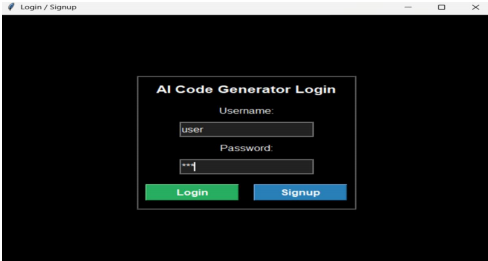
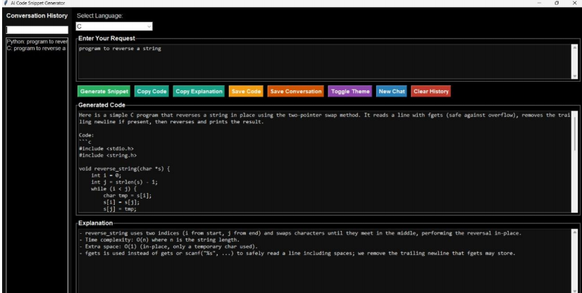

🤖 AI Code Snippet Generator Agent

An AI-powered desktop application that converts natural-language programming requests into ready-to-use code snippets with clear explanations using Large Language Models (LLMs).

This tool helps developers save time, learn faster, and write correct code through an interactive and secure AI-driven workflow.

✨ Features

* Natural language to code generation
* Supports multiple programming languages
* Provides step-by-step explanations for generated code
* Secure user login and signup system
* Conversation history storage and retrieval
* Dark and light theme support
* Copy, save, and export generated snippets
* Local-first storage ensuring privacy and reproducibility

🛠️ Technologies Used

| Layer                | Technology                            |
| -------------------- | ------------------------------------- |
| Programming Language | Python                                |
| GUI Framework        | Tkinter                               |
| AI Integration       | OpenRouter API (LLMs)                 |
| Storage              | Local files (users.txt, history logs) |
| Tools                | Requests, dotenv                      |

👥 User Roles

User

* Enter programming requests in natural language
* Select preferred programming language
* Generate code and explanations
* View conversation history
* Toggle themes and manage chats

📂 Modules

1. API Integration Module
2. User Authentication Module
3. Code Generation GUI Module
4. History & Conversation Management
5. Theme Management
6. Local Storage Management

🖼️ Screenshots

### Login / Signup

### Code Snippet Generator Page

🎯 Objectives

* Reduce time spent searching for code online
* Improve developer productivity and learning
* Provide consistent, well-explained code examples
* Ensure privacy, security, and reproducibility

The AI Code Snippet Generator Agent bridges the gap between human intent and implementation by delivering secure, explainable, and context-aware code generation, making it both a powerful developer assistant and a learning companion.

